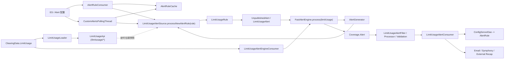

# LimitUsage Alert 链路梳理

本文基于以下可信来源整理：

1. `directory_structure`
2. 你补拍的近距离代码图
3. 你从完整公司代码库里通过 `find usage` / 跳转关系确认后再传回来的信息
4. 当前工作区中已重建并复核过的代码

不再使用早期错误转录或低可信分析 md 作为事实依据。

## 类流图

## 当前结论

现在已经可以把 `LimitUsage Alert` 的主链路说清楚，而且关键上游入口已经从“猜测”变成“已确认”：

- 规则不是前端直接推到 `LimitUsageAlertSource`
- `AlertRule` 会先进入 `AlertRuleConsumer`
- 启动或轮询补数时，`CustomAlertsPollingThread` 也会把规则重新灌进 `LimitUsageAlertSource`
- `LimitUsageAlertSource.processNewAlertRule(...)` 负责把原始 `AlertRule` 变成运行态 limit usage 规则
- 实时 `ClearingData.LimitUsage` 再进入 engine，与这些运行态规则匹配
- 命中后才生成并发布 `LimitUsageAlert`

所以你提的那个疑问，现在可以更明确地回答：

- 是的，信息流入后不是“直接发 alert”
- 而是先把 `AlertRule` 装载进 `LimitUsageAlertSource`
- 再由运行态规则实例去校验实时数据或定时拉取的快照
- 只有规则命中时才会生成 alert 并进入通知链路

## 模块职责

从当前已确认代码看，LimitUsage Alert 至少跨以下模块：

- `recap-server/limitusageloaderserver`
  负责消费 `ClearingData.LimitUsage`、维护快照缓存、提供查询接口。
- `aviator-dra`
  负责接收规则、持有运行态规则、接收实时 limit usage、生成 alert。
- `recap-server/limitusageserver`
  负责消费生成后的 `Coverage.Alert`，回查 `AlertRule` 并触发通知。
- `recap-server/recapserver`
  当前能确认提供 `ConfigServerDao`，用于回查 `AlertRule`。
- `model/alert-rule`
  提供 `AlertRule` 定义；当前工作区版本已足以支撑链路分析和调用，但尾部 getter/setter/builder 仍非完整 1:1。

## 规则是如何进入 aviator-dra 的

这部分现在已经有 solid source。

### 1. AlertRuleConsumer 是规则变更入口

根据你提供的 `find usage` 调用图，`LimitUsageAlertSource.processNewAlertRule(...)` 的直接调用方之一是 `AlertRuleConsumer`。

从图中可以确认：

- `AlertRuleConsumer` 实现 `DataConsumer<Coverage.NotificationAlert>`
- 它持有：
  - `AlertRuleSource source`
  - `AlertRuleCache alertRulesCache`
  - `CustomAlertSource customAlertSource`
  - `LimitUsageAlertSource limitUsageAlertSource`
- `consume(Coverage.NotificationAlert dataToConsume)` 中：
  - 先判断 `NotificationType == AlertRule`
  - 再从 `notificationContent` 反序列化出 `AlertRule`
  - 如果 `rule.getSoftDelete()` 为真：
    - 从 `alertRulesCache` 删除
    - 调用 `customAlertSource.processRemoveAlertRule(rule)`
    - 调用 `limitUsageAlertSource.processRemoveAlertRule(rule)`
  - 否则：
    - 先把规则加入 `alertRulesCache`
    - 再调用 `customAlertSource.processNewAlertRule(rule)`
    - 再调用 `limitUsageAlertSource.processNewAlertRule(rule)`

这说明：

- `AlertRuleConsumer` 接的是规则变更消息流
- 它把原始 `AlertRule` 同步到 cache
- 再把规则推给各个具体 alert source，包括 `LimitUsageAlertSource`

### 2. CustomAlertsPollingThread 是启动/补偿入口

你提供的第二张图确认了另一个调用方：`CustomAlertsPollingThread`。

从图中可以确认：

- 它持有：
  - `IElasticSearchDao elasticSearchDao`
  - `AlertRuleCache alertRulesCache`
  - `CustomAlertSource customAlertSource`
  - `LimitUsageAlertSource limitUsageAlertSource`
  - `AlertRuleGenerator alertRuleGenerator`
- `run()` 里会：
  - 先从 `elasticSearchDao.getAll(...)` 拉规则集合
  - 如果有 `alertRuleGenerator`，还会拿 `defaultRules()`
  - 把这些规则都放进 `alertRulesCache`
  - 然后对每条规则分别调用：
    - `customAlertSource.processNewAlertRule(rule)`
    - `limitUsageAlertSource.processNewAlertRule(rule)`

所以这条链路的作用不是“实时规则变更通知”，而更像：

- 启动时全量装载
- 轮询或补偿式重灌

## 规则进入 LimitUsageAlertSource 之后做什么

来自 [LimitUsageAlertSource.java](/Users/fortunebian/Downloads/futures_ui/ui-middle-tiers/ui-middle-tier-services/aviator-dra/src/main/java/com/xx/futures/evetor/alert/generator/sources/LimitUsageAlertSource.java)：

- `processNewAlertRule(AlertRule)` 会先过滤无效输入
- 然后判断是否是 `limit usage rule`
- 再做权限/entitlement 检查
- 再移除旧版本同 id 规则
- 最后按类型放入：
  - `thresholdRules`
  - `scheduledRules`

所以 `LimitUsageAlertSource` 并不是简单缓存原始 `AlertRule`，而是在做“规则接入、筛选、运行态分流”。

## 实时数据是如何命中这些规则的

### 1. 实时 limit usage 进入 engine

来自 [LimitUsageAlertEngineConsumer.java](/Users/fortunebian/Downloads/futures_ui/ui-middle-tiers/ui-middle-tier-services/aviator-dra/src/main/java/com/xx/futures/evetor/alert/alertengineconsumer/LimitUsageAlertEngineConsumer.java)：

- 当输入对象是 `ClearingData.LimitUsage`
- 就调用 `alertEngine.process(limitUsage)`

### 2. FastAlertEngine 把数据交给 alert source

来自 [FastAlertEngine.java](/Users/fortunebian/Downloads/futures_ui/ui-middle-tiers/ui-middle-tier-services/aviator-dra/src/main/java/com/xx/futures/evetor/alert/generator/FastAlertEngine.java)：

- `process(ClearingData.LimitUsage)` 会调用 `generateNewAlerts(limitUsage)`
- 进一步委托给 `alertGenerator.generateNewAlerts(limitUsage)`

### 3. LimitUsageAlertSource 遍历运行态规则

来自 [LimitUsageAlertSource.java](/Users/fortunebian/Downloads/futures_ui/ui-middle-tiers/ui-middle-tier-services/aviator-dra/src/main/java/com/xx/futures/evetor/alert/generator/sources/LimitUsageAlertSource.java)：

- 实时路径会遍历 `thresholdRules`
- 定时路径会在触发时拉 `/limitusage/accounts` 的最新快照
- 然后基于对应规则生成 alert

### 4. LimitUsageRule 做真正的命中判断

来自 [LimitUsageRule.java](/Users/fortunebian/Downloads/futures_ui/ui-middle-tiers/ui-middle-tier-services/aviator-dra/src/main/java/com/xx/futures/evetor/alert/generator/rules/LimitUsageRule.java)：

- 它持有：
  - `AlertRule`
  - `Common.Application`
  - `ActiveAlerts`
- 它负责判断：
  - venue 是否命中
  - account 是否命中
  - threshold 是否 breach
  - 当前是否已有 active alert

当前已确认的 account 维度包含：

- `clientRefId`
- GMI synonym

因此这里不是“原始数据一进来就直接发 alert”，而是：

1. 先有运行态规则
2. 再让实时数据去撞这些规则
3. 命中后返回 `ImmediateAlert` 或其他 unpublished alert

## time-based 规则链路

来自 [LimitUsageAlertSource.java](/Users/fortunebian/Downloads/futures_ui/ui-middle-tiers/ui-middle-tier-services/aviator-dra/src/main/java/com/xx/futures/evetor/alert/generator/sources/LimitUsageAlertSource.java)：

- time-based 规则进入 `scheduledRules`
- 到点后不是等实时消息，而是主动拉 `/limitusage/accounts`
- 用拉回来的 snapshot 做一次规则计算

这说明 threshold 与 time-based 的核心差别是：

- threshold：实时消息驱动
- time-based：定时 snapshot 驱动

## limit usage 数据来源

来自 [LimitUsageLoader.java](/Users/fortunebian/Downloads/futures_ui/ui-middle-tiers/ui-middle-tier-services/recap-server/src/main/java/com/xx/futures/evetor/limitusageloaderserver/loader/LimitUsageLoader.java)：

- `LimitUsageLoader` 消费 `ClearingData.LimitUsage`
- 更新本地 cache
- key 主要是：
  - `clientRefId`
  - GMI synonym

来自 [LimitUsageApi.java](/Users/fortunebian/Downloads/futures_ui/ui-middle-tiers/ui-middle-tier-services/recap-server/src/main/java/com/xx/futures/evetor/limitusageloaderserver/rest/LimitUsageApi.java)：

- 对外暴露 `/all`、`/account`、`/accounts`

因此 `aviator-dra` 的 time-based 规则依赖的是 loader server 上的 limit usage 快照，而不是直接访问 ES。

## alert 生成后如何通知

这段你已经确认相关类和事实一致，可以作为可信链路保留。

### 1. 通知侧基础处理

已确认类：

- [LimitUsageAlertFilter.java](/Users/fortunebian/Downloads/futures_ui/ui-middle-tiers/ui-middle-tier-services/recap-server/src/main/java/com/xx/futures/evetor/limitusageserver/alerts/LimitUsageAlertFilter.java)
- [LimitUsageAlertProcessor.java](/Users/fortunebian/Downloads/futures_ui/ui-middle-tiers/ui-middle-tier-services/recap-server/src/main/java/com/xx/futures/evetor/limitusageserver/alerts/LimitUsageAlertProcessor.java)
- [LimitUsageAlertRuleValidation.java](/Users/fortunebian/Downloads/futures_ui/ui-middle-tiers/ui-middle-tier-services/recap-server/src/main/java/com/xx/futures/evetor/limitusageserver/alerts/LimitUsageAlertRuleValidation.java)

职责分别是：

- filter：只放行 `LimitUsageAlert` 且做 alertId 去重
- processor：把消息转成 `Coverage.Alert`
- validation：决定 generic email / symphony / room message 是否该发

### 2. 回查 AlertRule 后决定通知方式

来自 [LimitUsageAlertConsumer.java](/Users/fortunebian/Downloads/futures_ui/ui-middle-tiers/ui-middle-tier-services/recap-server/src/main/java/com/xx/futures/evetor/limitusageserver/alerts/LimitUsageAlertConsumer.java) 和 [ConfigServerDao.java](/Users/fortunebian/Downloads/futures_ui/ui-middle-tiers/ui-middle-tier-services/recap-server/src/main/java/com/xx/futures/evetor/recapserver/dao/ConfigServerDao.java)：

- 消费到 `Coverage.Alert` 后
- 先从 alertId 反推 ruleId
- 再通过 `configServerDao` 回查 `AlertRule`
- 再根据 `AlertRule` 配置决定发：
  - external client email
  - generic email
  - symphony room
  - symphony team room

根据你从完整公司代码库里做的调用关系确认：

- `ConfigServerDao.getAlertRuleById(...)` 的上游最终能落到一个大的 endpoint 提供类 `AlertsRestBase`
- 其中存在 `/rules`、`/rule`、`/rule/{id}` 等与 `AlertRule` 相关的 endpoint
- 这些 endpoint 会调用 `elasticSearchDao.getXX(...)`

所以通知侧依赖的是“alert + 回查 rule 配置”的组合，而不是只靠 alert 本体。
对当前线程来说，这条关系已经足够，不需要继续转写 `AlertsRestBase` 整个大类。

## 当前可以稳定确认的完整主链路

现在可以把主链路更准确地写成下面这 12 步：

1. 前端侧创建好的 alert 规则最终表现为 ES / alert 配置中的 `AlertRule`
2. 规则变更消息进入 `AlertRuleConsumer`
3. `AlertRuleConsumer` 反序列化出 `AlertRule`
4. `AlertRuleConsumer` 把规则写入 `AlertRuleCache`
5. `AlertRuleConsumer` 调用 `LimitUsageAlertSource.processNewAlertRule(rule)` 或 `processRemoveAlertRule(rule)`
6. 启动/轮询补偿时，`CustomAlertsPollingThread` 也会批量把 ES / generated rules 灌入 `LimitUsageAlertSource`
7. `LimitUsageAlertSource` 对原始 `AlertRule` 做 limit usage 规则识别、权限检查、旧版本替换、threshold/time-based 分流
8. 实时 `ClearingData.LimitUsage` 通过 `LimitUsageAlertEngineConsumer -> FastAlertEngine` 进入 alert pipeline
9. `LimitUsageRule` 对实时数据做命中判断；time-based 规则则在定时点通过 loader server 拉 snapshot 再判断
10. 命中后由 `FastAlertEngine` 生成并发布 `LimitUsageAlert`
11. `limitusageserver` 侧消费 `Coverage.Alert`，做 filter/process/validation
12. `LimitUsageAlertConsumer` 回查 `AlertRule` 后决定最终通知方式

## 对你问题的直接回答

你问的是：

“我不确定的是信息流入时是否是经过生成的规则的实例校验，触发的话就发送alert？”

当前答案是：

- 是，基本可以这么理解。
- 但更准确一点说，不是“先生成 alert 再校验”，而是：
  - 先把 `AlertRule` 接入并转成 `LimitUsageAlertSource` 持有的运行态规则
  - 实时或定时得到的 limit usage 数据再去匹配这些规则
  - 匹配成功后才生成 alert

也就是：

- `AlertRule` 是配置层
- `LimitUsageRule` 是运行态判定层
- `FastAlertEngine` 是统一生成/发布层

## 已确认不再继续扩展的点

按你最新确认：

- `LimitUsageAlertConsumer`
- `LimitUsageAlertAckingConsumer`
- `ConfigServerDao`

这些类当前版本已经与事实和图片一致，不再作为待补拍项。

另外：

- 项目里没有带 `Controller` 关键字的类，因此之前把 `LimitUsageRuleController` 作为优先补拍项是不成立的，现已从推断链中移除。
- `AlertsRestBase` 只作为 `ConfigServerDao -> AlertRule endpoint -> elasticSearchDao` 的关系证据保留，不需要在本线程中做大类转写。

## 仍然不够 1:1 的部分

当前还没完全闭合的，主要只剩两类：

### 1. AlertRule model 尾部

当前 [AlertRule.java](/Users/fortunebian/Downloads/futures_ui/model/alert-rule/src/main/java/com/xx/jetstream/model/alert/AlertRule.java) 已经够支撑分析和当前调用，但仍不是完整 1:1：

- getter/setter 尾部没拍全
- builder 尾部没拍全

### 2. alert 发布后的最终下游

如果你还要把“生成之后具体怎么 publish”彻底补死，最值得补的是：

- `AlertPublisher`
- 具体 publisher target / downstream publish 类

这不影响当前 LimitUsage 规则判定链路，但会影响“alert 发布到总线后的最后一跳”理解精度。
